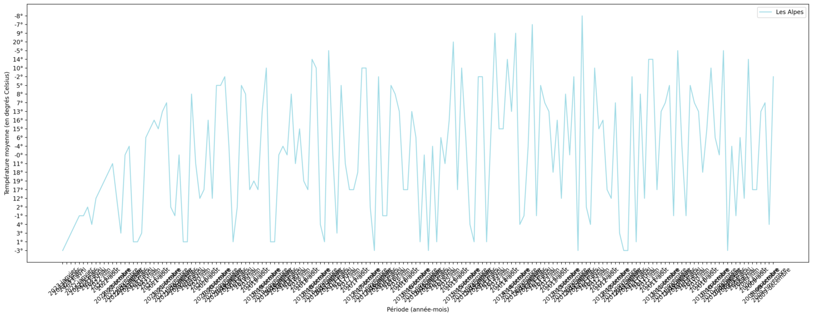

<h1 align="center">
    script_Scrapt 
</h1>

<h2 align="center">  Sommaire</h2>

- [Introduction](#introduction)
- 1er Script : [Scraper](#scraper-des-données)
- 2e Script : [Créer une base de données](#crée-une-base-de-donées)
- 3e Script : [Graphique utilisant Streamlit](#affichage-statistique)
- [Conclusion](#conclusion)

---

## Introduction

Il s'agit d'un dépôt pédagogique sur le scraping, réalisé en collaboration avec mon ami Abdel (faire un lien vers le GitHub d'Abdel).

Le projet consiste à créer 3 scripts :
1. Un scraper générant des données sous forme de tableaux
2. Un script capable d'ingérer les données dans la base de données
3. Affichage des données sur Streamlit (tableau, 2-3 graphiques qui représentent vos données)

## Scraper des données

Alors qu'est-ce que le scraping ?

> Le scraping ou le scrapping (en français : extraction de données) consiste à récupérer automatiquement des informations ou des données à partir d'un site web ou d'une autre source en ligne en utilisant des programmes informatiques appelés "scraper" ou "web scraper". Ces données peuvent être collectées pour des raisons d'analyse, de recherche ou pour alimenter une base de données.

 Mais attention ! Il peut être illégal de scraper des données, il est important de vérifier la politique de chaque site web.

### Quoi Scraper

C'est la partie qui demande le plus de réflexion. 😅
Nous allons scraper le site web suivant : https://www.historique-meteo.net/france/.
Il s'agit d'un site web archivant les météos de différents pays.
Voici un exemple de ce que nous essaierons de récupérer :

| ID | Région | Année | Mois | Température moyenne | Température maximale | Température minimale | Température maximale maximum | Température minimale maximum | Température minimale minimum | Vitesse du vent | Température du vent | Précipitations moyennes par jour | Record de précipitations sur une journée | Humidité | Visibilité | Couverture nuageuse | Heure du lever du soleil | Heure du coucher du soleil | Durée du jour |
| ----- | ----- | ----- | ----- | ----- | ----- | ----- | ----- | ----- | ----- | ----- | ----- | ----- | ----- | ----- | ----- | ----- | ----- | ----- | ----- |
| 0 | les Alpes | 2023 | JANVIER | -3 | 1 | -7 | 16 | 9 | -26 | 10km/h | -11 | 1mm | 11mm | 90% | 9km | 50% | 08:18:00 | 17:45:00 | 9:27:0 |
| ... | ... | ... | ... | ... | ... | ... | ... | ... | ... | ... | ... | ... | ... | ... | ... | ... | ... | ... | ... |

La technologie utilise surtout les librairies pandas et Beautiful Soup. Avec Python, bien sûr.
FINI.

## Crée une base de donées

À partir des données collectées, je dois créer une base de données.
Rien à dire.

## Affichage statistique

Nous avons dus le faire script uniquement python car il faut faire cette commande :

```bash
      $ streamlit run "your_script.py"
```

Voici un exemple de graphique : 




## Conclusion 

Ce travail a été fait avec [Abel](https://github.com/Aboubakar-Ali), camarade de promo et ami.
Nous avons appris à nous familiariser avec Streamlit. Donc,

Merci à [Abel](https://github.com/Aboubakar-Ali), ce fut un super travail de le faire avec lui, très compétent pour le code en Python. Nous avons travaillé en bonne alchimie.

## Auteur

Ce projet a été réalisé par MOI !!! :smiley:

| Infos | Où me retrouver |
| ------------- | -------------------------------------------------------------------- |
| Nom👋 | Zaoui |
| Prénom😄 | Yassine |
| Pseudo😁 | Yatsu |
| Login 42🏫 | Yzaoui |
| E-mail📬 | y.zaoui.pro@gmail.com |
| E-mail42📩 | yzaoui@student.42.fr |
| Linkedin👨‍💻 | Yassine Zaoui|
| Instagram📸 | @yatsu__officiel |
